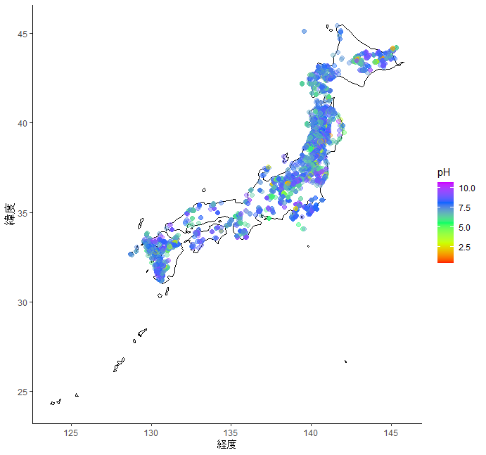

```{r setup, include=FALSE}
knitr::opts_chunk$set(echo = TRUE)
```

## はじめに

温泉とは、昭和23年に制定された「温泉法」により、地中から湧出する温泉、鉱水及び水蒸気その他のガス（炭化水素を主成分とする天然ガスを除く。）で、表１の温度又は物質を有するものと定義されている（環境省）。2020年3月現在、日本全体には27969の源泉があり、うち2971が温泉地として観光地として利用されている（環境省）。日本は世界全体で見ても例を見ないほど温泉が観光地として利用されており、国民からの知名度・好感度は高いと言える。

また、温泉は地質の影響を受けてその成分が大きく変化する。温泉の成分を示す「温泉分析書」は温泉法第18条4項において掲示が義務付けられており（環境省）、一部の温泉ではインターネット上で公開していることもある。温泉分析書にはpHや陽イオンについての記述があるため、高校化学基礎の「酸・塩基」に関して探求学習を行う上で有用であると考えられる。

本レポートは、日本全国の温泉について、そのpHや温度をまとめたものである。

## 方法

分析に用いる温泉地のデータは日本原子力研究開発機構が公開する「温泉地化学データベース」を用いた。格納されているデータのうち、緯度、経度およびpHが記述されている6243ヶ所のみを抽出し、分析に使用した。温泉データベースの

分析ではまずpHに着目し、日本全国の温泉におけるpHおよび温度を日本地図上にプロットした。さらにこれらを、強酸性、弱酸性、弱塩基性、強塩基性に分類してプロットし、pHの局所性の把握を試みた。

なお、すべての分析は統計分析言語「R」を用いた。また、日本地図の描画に関してはRのライブラリ「ggplot」「maps」を、データの処理には「tidyverse」を用いた。

## 結果・考察





